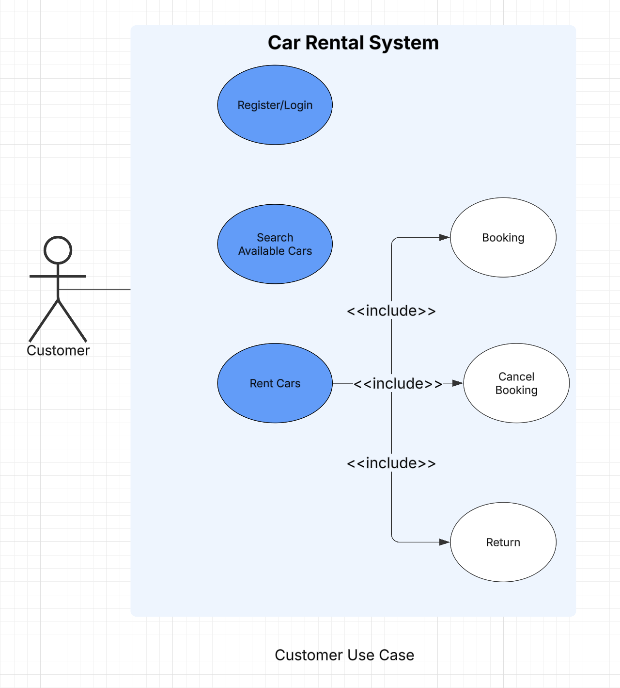
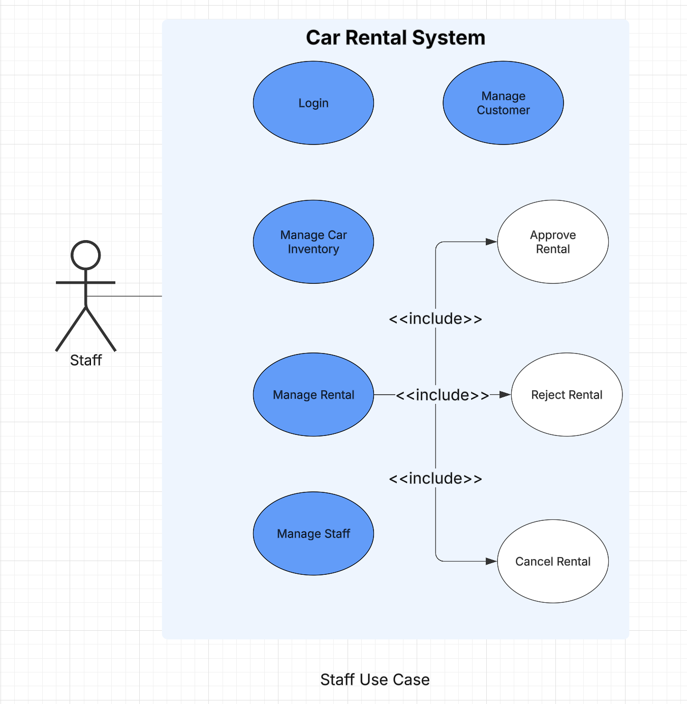
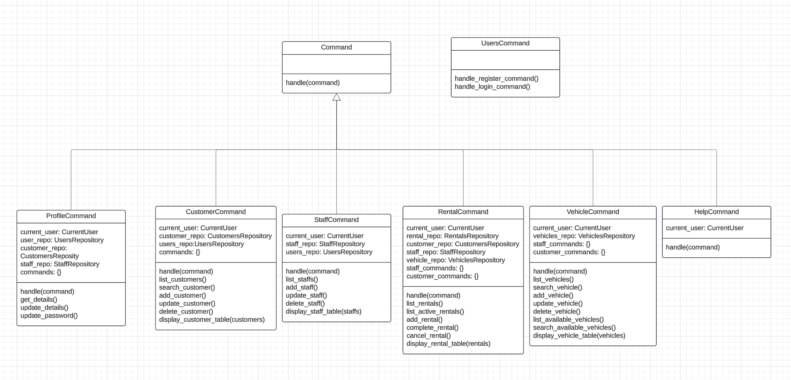
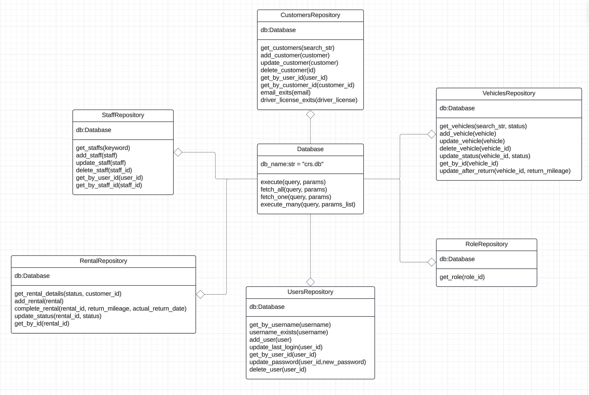
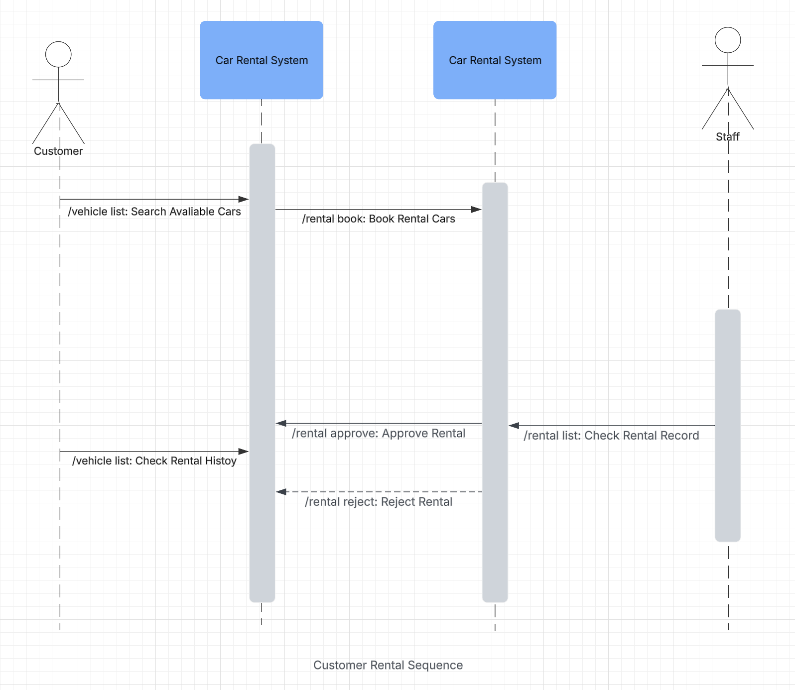

# Introduce

The Car Rental System is a CLI application that automates and manages the car rental business operations. It helps rental companies manage their vehicles, customer bookings, and overall rental processes.

# Design and Architecture

## UML Diagram

### Use case





### Class Diagram





### Sequence Diagram



## Design Pattern

1. Factory Design Pattern

I use factory design pattern to implement generating a command class base on user input.The `app/command` folder contains all the command classes. The `factory.py` has a `CommandFactory` class and It has a static method `get_command` to generate a command class.

2. Singleton Design Pattern

I also use singleton design pattern to make sure there is only one command instance. You can see the command classes in `app/command` folder, like `CustomerCommand`, `RentalCommand`, they all have a `@singleton` annotation.

# Software Evolution

## Maintenance

I use some strategies to keep the project have a good maintenance.

- Use Git to keep meaningful commit messages and tags that can help me track the project process.
- Write tests with `pytest` to keep the project robust
- Use `requirements.txt` to keep dependency install correctly
- Use Github Action to automate CI/CD pipeline

## Versioning

I use git tags for versioning, and combine sematic versioning (MAJOR.MINOR.PATCH)

- MAJOR: Breaking changes (e.g., 2.0.0)
- MINOR: New features but backward compatible (e.g., 1.1.0)
- PATCH: Bug fixes (e.g., 1.0.1)

```bash
# Create a version tag use git tag
git tag v1.0.0
git push origin v1.0.0
```

## Compatibility

1. Use Virtual Environments for Isolation:

```bash
python3 -m venv .venv
source .venv/bin/activate # macOS/Linux
.venv\bin\activate     # Windows
```

2. Use Github Action CI Workflow to test different version (`.github/workflows/ci.yml`):
